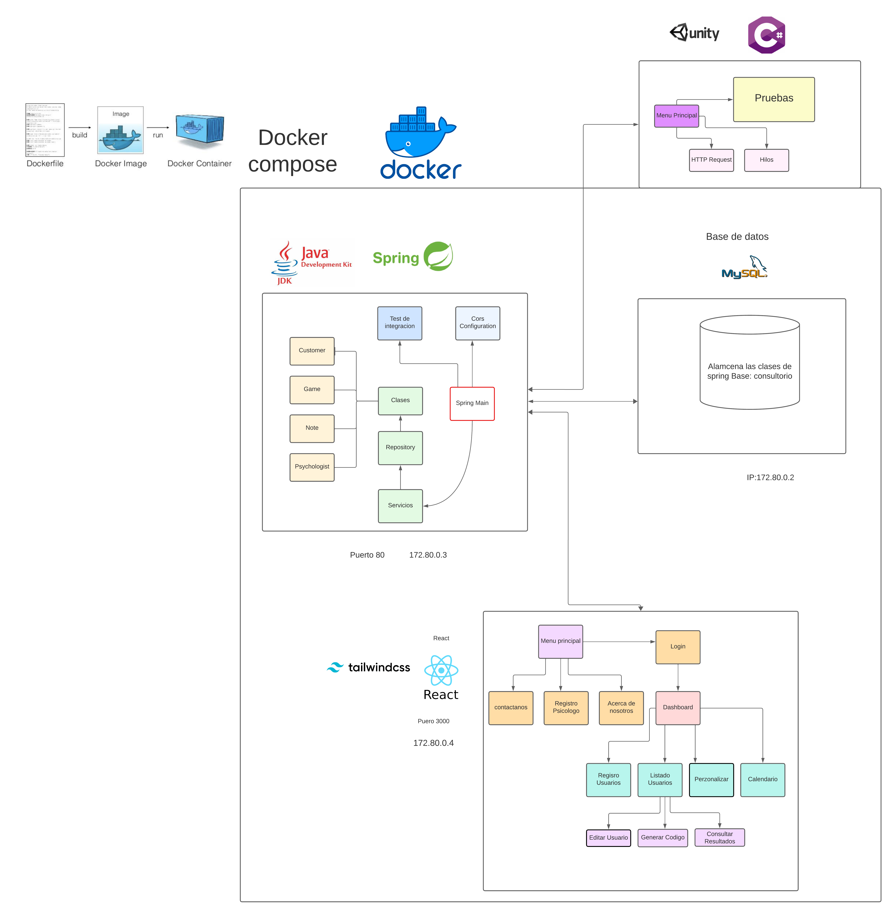

# Psychology Project

Test de Wais. Hello everyone, this is a project dedicated to psychology in which we aim to automate the Wais psychologist test for children. Essentially, we provide psychologists with tools to 
streamline their work through automation and remote pattern detection, without the need to be in the office with the patient.

## Requirements
   - Install Apache Maven and set it in environment variables.
   - Download Java Development Kit 17.
   - Download Docker.
   - Unity version 2021.2.4f1.

## Project Compilation Instruction (Windows & linux)
  
There are two ways to compile the project. The first and the easiest one is to use the 'buildall.sh' file. It contains all the necessary instructions to create
 all the services with Docker Compose only run the command in like this "./buildall.sh".

The second option is to compile the project manually go to the next path: JavaSpring\Psychologi2 When you run the next command

**mvn clean install**

or if you want to avoid running the integration test

**mvn clean install -DskipTests**

This will refresh the necessary JAR file that is necessary for the backend image. Check if everything is okay, must see the “BUILD SUCCESSFUL” message.
Next, return to the root directory and execute the following command:

**docker-compose up --build**

This will execute the docker-compose and will search the docker files from the different services is important to have an Internet connection when you run 
this step because it will need to download some requirements from the docker-hub

## Services Location

if everything with compiled you can access the front-end application via the following URL:

**http://localhost:3000**

Also if you want to watch the swagger documenttion of the back-end click the next URL

**http://localhost:8080/swagger-ui/index.html**

Also, you can make an HTTP request with Postman if you want.

## Diagram

## Common Issues

If you encounter problems when starting Docker containers, make sure you have the necessary ports available for local execution. In this case, it's ports 3306, 8080, and 3000. If any of these ports are occupied, the application won't deploy correctly.
Check the options to free up ports on your computer.

## Keep in touch

If you have any ideas for implementing enhancements to my project or any feedback on my work, please feel free to send an email to jesus.jarr.30@gmail.com

Regards 
Jesus Renteria
